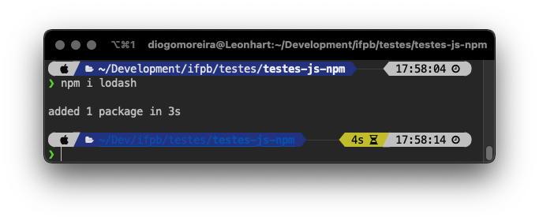

# Estrutura léxica

A estrutura lexical de uma linguagem é o **conjunto de regras elementares que especifica como você escreve programas nessa linguagem**. É a sintaxe de nível mais baixo de uma linguagem: ela especifica a **aparência dos nomes de variáveis**, os **caracteres delimitadores para comentários** e **como uma instrução de programa é separada da próxima**, por exemplo.

### Texto/Código

JavaScript é uma linguagem que diferencia maiúsculas de minúsculas \(**Case Sensitive**\). Isso significa que variáveis, nomes de função e outros identificadores devem sempre ser digitados com capitalização consistentes. A palavra-chave `while`, por exemplo, deve ser digitada “`while`”, não “`While`” ou “`WHILE`”. Da mesma forma, `online`, `Online`, `OnLine` e `ONLINE` são quatro nomes de variáveis distintos.

JavaScript **ignora os espaços** que aparecem entre as linhas de código, assim você pode usar espaços e novas linhas livremente em seus programas, formatar e recuar seus programas de uma forma limpa e consistente que torna o código fácil de ler e entender.


Uma boa forma de manter a consistência na organização de seu código é usando um formatador, como o [**Prettier**](https://prettier.io/) para Visual Studio Code. Essas ferramentas geralmente funcionam no Codesandbox também.


### Comentários

JavaScript suporta dois estilos de comentários. Qualquer texto entre `//` e o final de uma linha é tratado como um **comentário** e é ignorado pelo JavaScript. Qualquer texto entre os caracteres `/*`  __e __ `*/` também é tratado como um comentário. Esses últimos podem abranger várias linhas, mas não podem ser aninhados. As seguintes linhas de código são todos comentários válidos de JavaScript:

```javascript
// Comentário de uma linha.
/* Também um comentário */  // e aqui outro comentário.
/*
 * Esse é um comentário ao longo de várias linhas
 * o caracter * não é necessário a cada linha, mas é uma boa prática
 */
```

### Literais

"**Literal**" é um valor que você escreve literalmente no seu script, pode ser atribuindo a uma variável, ou passando com argumento de uma função, ou até escrever solto no seu script, sem atribuir.

```javascript
12            // Número '12'
1.2           // Número '1.2'
"hello world" // A String "hello world"
'Hi'          // A String "Hi"
true          // Boolean verdadeiro
false         // Boolean falso
null          // Ausência de valor
```

### Identificadores e palavras reservadas

Um identificador é simplesmente um **nome**. Em JavaScript, os identificadores são usados para nomear **constantes**, **variáveis**, **propriedades**, **funções** e **classes** e para fornecer rótulos para certos loops no código JavaScript.

Um identificador JavaScript deve começar com uma letra, um sublinhado \(`_`\) ou um cifrão \(`$`\). Os caracteres subsequentes podem ser letras, dígitos, sublinhados ou cifrões. **Dígitos não são permitidos como o primeiro caractere** para que o JavaScript possa facilmente distinguir identificadores de números. Esses são todos identificadores legais:

```javascript
i
my_variable_name
v13
_dummy
$str
```

### Palavras reservadas

As palavras a seguir fazem parte da linguagem JavaScript. Muitas delas \(como `if`, `while` e `for`\) são **palavras-chave reservadas** que não podem ser usadas como nomes de **constantes**, **variáveis**, **funções** ou **classes** \(embora todas possam ser usadas como nomes de propriedades dentro de um objeto Javascript, veremos isso depois\).

Outras palavras-chave \(como `let`\) não podem ser totalmente reservadas para manter a compatibilidade com programas mais antigos e, portanto, existem regras complexas que determinam quando podem ser usadas como identificadores e quando não podem. 

O mais simples é evitar o uso de qualquer uma dessas palavras abaixo como identificadores, exceto `from`, set e `target`, que são seguros de usar e já estão sendo comumente usadas.



Uma lista provavelmente sempre atualizada e mais detalhada pode ser encontrada [aqui](https://developer.mozilla.org/pt-BR/docs/Web/JavaScript/Reference/Lexical_grammar#palavras-chave). Lembre-se que Javascript está em constante atualização e pode ter algumas palavras novas nos próximos anos.

### Ponto e vírgula opcional

Assim como muitas linguagens de programação, o JavaScript usa o ponto-e-vírgula \(`;`\) para separar as instruções umas das outras ao final de cada linha. Isso é importante para tornar claro o significado de seu código: **sem um separador, o final de uma instrução pode parecer o início da seguinte, ou vice-versa**.

Em JavaScript, você **pode omitir o ponto-e-vírgula** entre duas instruções se essas instruções forem escritas em linhas separadas. **Muitos programadores de JavaScript usam ponto-e-vírgula para marcar explicitamente o final das instruções**, mesmo onde eles não são necessários. Outro estilo é omitir ponto-e-vírgulas sempre que possível, usando-os apenas nas poucas situações que os exigem.

Seja qual for o estilo que você escolher, existem alguns detalhes que você deve entender sobre ponto-e-vírgulas opcionais em JavaScript. Considere o seguinte código. Como as duas instruções aparecem em linhas separadas, o primeiro ponto e vírgula pode ser omitido:

```javascript
a=3; b=4;
```

Escrito da seguinte forma, no entanto, o primeiro ponto e vírgula é obrigatório:

```javascript
a = 3; b = 4;
```

Observe que o JavaScript não trata cada quebra de linha como um ponto-e-vírgula: ele **geralmente trata as quebras de linha como ponto-e-vírgula apenas se não puder analisar o código sem adicionar um ponto-e-vírgula implícito**.

Mais formalmente \(e com três exceções descritas um pouco mais tarde\), o JavaScript trata uma quebra de linha como um ponto e vírgula se o próximo caractere \(que não seja espaço\) não puder ser interpretado como uma continuação da instrução atual. Considere o seguinte código:

```javascript
let a
a
=
3 console.log(a)
```

Isso seria interpretado como:

```javascript
let a; a = 3; console.log(a);
```

De qualquer maneira, durante essa disciplina, usaremos ponto-e-vírgula para deixar mais explicito o início e o fim de cada instrução, uma vez que algumas podem exceder o espaço de uma linha inteira. Fique a vontade pra programar da maneira que achar mais confortável.

