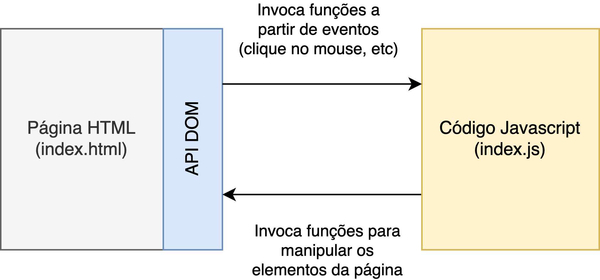

# Entrada e saída

Como qualquer programa em outras linguagens, os programas JavaScript processam **dados de entrada** para produzir **dados de saída**. Há uma variedade de entradas disponíveis:

* O conteúdo do próprio documento, que o código JavaScript pode acessar com a API DOM
* Entrada do usuário, na forma de eventos, como cliques do mouse \(ou toques na tela de toque\) em elementos HTML. Ou texto inserido em elementos HTML `<input>` ou `<textarea>`, por exemplo.
* O URL do documento que está sendo exibido está disponível para o JavaScript do lado do cliente como `document.URL`.

JavaScript do lado do cliente normalmente produz saída, quando necessário, **manipulando o documento HTML com a API DOM**. A imagem abaixo ilustra como geralmente ocorre essa interação no ambiente do browser.

