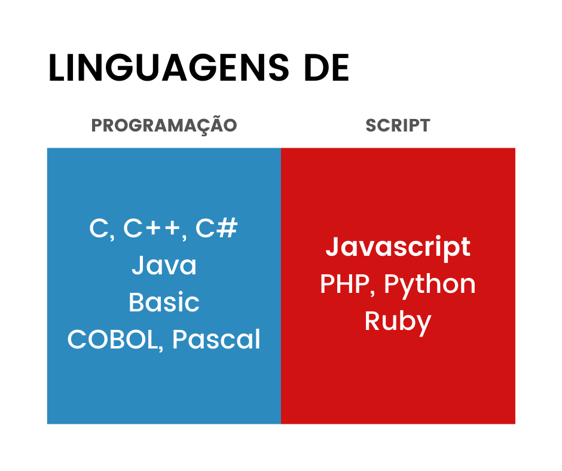

# Introdução a Linguagens de Scripts

Freqüentemente, as pessoas usam os termos **linguagem de script** como sinônimo de **linguagem de programação**, mas esses dois termos têm mais diferenças do que você conhece. Embora **todas as linguagens de script sejam linguagens de programação**, nem todas as linguagens de programação são linguagens de script.

A **principal diferença** entre uma linguagem de script e uma linguagem de programação está em sua **execução** - as linguagens de programação usam um compilador para converter as linguagens de programação de alto nível em linguagem de máquina, por outro lado, as **linguagens de script usam um interpretador**. Enquanto um compilador compila um código em um pedaço completo, um interpretador compila um código linha por linha.

### Definição

Uma **linguagem de programação é essencialmente uma linguagem formal** que combina um conjunto de instruções que podem ser alimentadas no computador para gerar uma saída específica. Uma linguagem de script é uma linguagem de programação que oferece suporte a scripts que são **programas escritos exclusivamente para um ambiente especial** para automatizar a execução de uma ação / função específica.

### Interpretação

As linguagens de programação \(C, por exemplo\) são compiladas de uma maneira mais compacta que não requer interpretação por outra linguagem ou aplicativo. Já as linguagens de script são **escritas em uma linguagem e interpretadas em outro programa**, por exemplo, o JavaScript \(que usaremos nessa disciplina\) deve ser incorporado ao HTML, que será então interpretado pelo _browser_.

Portanto, as **linguagens de programação são executadas independentemente de um outro programa**, enquanto as **linguagens de script são executadas dentro de outro programa**.

### Exemplos

A imagem abaixo traz alguns exemplos de linguagem de programação e de scripts.

