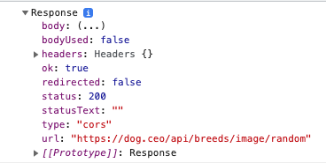

# Promises

Agora que vimos exemplos de _callback_ e programação assíncrona baseada em eventos em ambientes JavaScript do lado do cliente, podemos apresentar **Promises**, um recurso de linguagem projetado para **simplificar a programação assíncrona**.

Uma `Promise` é um objeto que representa o resultado de um **processamento assíncrono**. Esse resultado **pode ou não estar pronto ainda** \(existe a "promessa" de que ela vai estar concluída\), e a API Promise é intencionalmente vaga sobre isso: **não há como obter de forma síncrona o valor de uma Promise**; você só pode pedir à Promise para **chamar uma função de callback quando o valor estiver pronto**.

### Utilizando Promises

Observe a função abaixo:

```javascript
function aguardar() {
  return new Promise((resolve, reject) => {
    setTimeout(() => {
      resolve("A Promise foi resolvida");
    }, 6000);
  });
}
```

Essa função retorna uma `Promise` que **resolve** seu valor final após 6 segundos. Ao criar uma nova Promise, passamos uma função de _callback_, que recebe ao menos duas funções: **resolve** e **reject**, que iremos chamar para o caso da Promise ser cumprida \(**resolve**\) ou ser rejeitada por erro ou outro caso \(**reject**\).

Quando resolvemos uma promise, podemos passar por parâmetro um valor que será recebido no método _then_. Da mesma forma, ao rejeitarmos uma promise podemos passar um motivo para tal, um valor conhecido como `reason`.

Um **`Promise`** sempre está em um destes estados: 

* _pending \(_pendente_\)_: Estado inicial, que não foi realizada nem rejeitada.
* _fulfilled \(_realizada\): sucesso na operação.
* _rejected \(_rejeitado\):  falha na operação.

Para utilizarmos essa função, devemos invocar a função `aguardar` e associar _callbacks_ para os casos de ser resolvida ou rejeitada. É aqui que usamos as funções `then` e `catch`

```javascript
aguardar()
  .then((resposta) => console.log(`Sucesso: ${resposta}`)) // Caso dê certo
  .catch((error) => console.log(`Erro: ${error}`)); // Caso dê errado
```

### Utilizando Promises com `fetch`

A API **`Fetch`** é uma interface simples para buscar recursos tanto no nosso próprio site quanto em sites externos. `Fetch` nos permite fazer **requisições** de rede e lidar com respostas de maneira fácil. Essa API é baseada em Promises, e usaremos ela aqui para que o entendimento de Promises fique mais óbvio com exemplos que podem servir no dia-a-dia.


Usaremos a API [https://dog.ceo/dog-api/](https://dog.ceo/dog-api/) para buscar **imagens de cachorros**, apenas para exemplificar 🐶, mas a partir daqui você poderá usar Fetch para consumir recursos inclusive de [**Facebook**](https://developers.facebook.com/), [**Twitter**](https://developer.twitter.com/en), [**Spotify**](https://developer.spotify.com/documentation/web-api/) e outros serviços.


A função `fetch` usa um argumento obrigatório, que é **o caminho para o recurso que você deseja buscar**, e retorna uma Promise que resolve a resposta dessa solicitação.

```javascript
fetch("https://dog.ceo/api/breeds/image/random");
```

Nesse momento, recebemos uma Promise, que em um primeiro momento está como _pending_ e logo depois é resolvida ou rejeitada. No entanto, não temos ainda uma maneira de verificar o que foi retornado dessa Promise. Usaremos então a função `then`.

```javascript
fetch("https://dog.ceo/api/breeds/image/random").then(
    (response) => { // Função de callback, que recebe o que veio da requisição
        console.log(response);
    }
);
```

Conseguimos imprimir a resposta, mas ela ainda não está adequada ao que queremos. Ao logar no console, podemos ver na imagem abaixo que ele traz algumas informações do tipo `status`, que **indicam se tudo deu certo ou não** \(e você pode ver mais desses status [aqui](https://pt.wikipedia.org/wiki/Lista_de_c%C3%B3digos_de_estado_HTTP)\).



Aqui entra um conceito interessante: podemos invocar `then` quantas vezes quisermos para **transformar** nossa resposta. Vamos então pedir para transformar nossa resposta em um JSON \(um objeto em Javascript\) e logo depois, vamos imprimir novamente no console.

```javascript
fetch("https://dog.ceo/api/breeds/image/random")
  .then((response) => response.json()) // Transformo a resposta em JSON
  .then((json) => console.log(json)); // E o JSON é passado para o segundo then
```

Agora teremos uma resposta em **objeto** que pode ser usada da maneira que desejar. A propriedade `message` nos traz um endereço pra imagem que queremos

```javascript
{
    message: "https://images.dog.ceo/breeds/hound-walker/n02089867_3103.jpg",
    status: "success"
}
```

E caso alguma coisa dê errado, utilizaremos a função `catch`. É importante que essa função **sempre** esteja presente.

```javascript
fetch("https://dog.ceo/api/breeds/image/random")
  .then((response) => response.json())
  .then((json) => console.log(json))
  .catch((error) => alert("Erro ao requisitar a imagem"));
```


